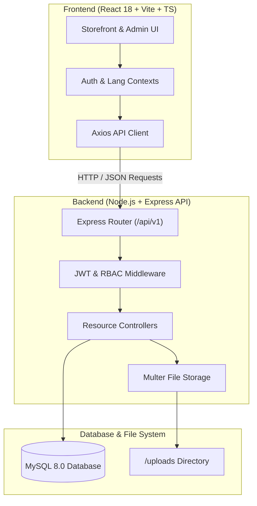
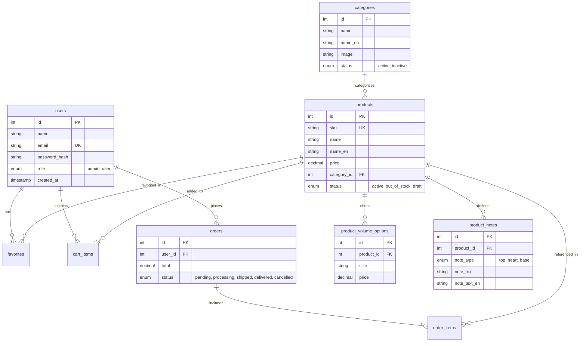

# ✨ PUREVEIL — Luxury Fragrance & E-Commerce Platform

[](https://nodejs.org/)
[](https://react.dev/)
[](https://www.typescriptlang.org/)
[](https://vitejs.dev/)
[](https://tailwindcss.com/)
[](https://www.mysql.com/)
[](https://expressjs.com/)
[](LICENSE)

---

## 📌 Table of Contents

- [Overview](#-overview)
- [Key Features](#-key-features)
- [Technology Stack](#-technology-stack)
- [System Architecture](#-system-architecture)
- [Database Schema & ERD](#-database-schema--erd)
- [Project Directory Structure](#-project-directory-structure)
- [Prerequisites](#-prerequisites)
- [Getting Started & Installation](#-getting-started--installation)
- [Default Seed Credentials](#-default-seed-credentials)
- [API Reference](#-api-reference)
- [Environment Variables](#-environment-variables)
- [Scripts & Commands](#-scripts--commands)
- [License](#-license)

---

## 📖 Overview

**PUREVEIL** is a modern, production-ready, full-stack luxury perfume and fragrance platform built with a high-performance **React 18 + TypeScript + Vite + Tailwind CSS** frontend and a robust **Node.js + Express + MySQL** RESTful backend. 

Engineered with full **bilingual localization (English & Arabic with RTL/LTR design)**, role-based access control, an interactive customer storefront, and a protected administration panel, PUREVEIL provides an elevated digital experience for fragrance enthusiasts and store operators alike.

---

## ✨ Key Features

### 🛍️ Customer Storefront & Shopping Experience
- **Interactive Catalog**: Real-time product search, category filtration, price range filtering, sorting, and pagination.
- **Fragrance Pyramid Details**: Displays 3-tier olfactory note pyramids (Top Notes, Heart Notes, Base Notes), concentration levels, sillage rating, and longevity metrics.
- **Dynamic Size Variants**: Select volume sizes (e.g., 50ml, 100ml) with instant price calculations.
- **Persistent Cart & Wishlist**: Real-time shopping cart and favorites sync linked directly to the MySQL database.
- **Seamless Checkout**: Streamlined checkout flow supporting multiple payment options and order summaries.
- **User Account Portal**: Edit profile information, change passwords, and track order histories.

### 🌍 Bilingual & RTL/LTR Localization
- **Complete Dual-Language Support**: Instant switching between **English** and **Arabic**.
- **Native RTL Layouts**: Full UI mirror support ensuring natural typography and navigation in Arabic mode.
- **Bilingual Database Architecture**: Every entity (categories, products, fragrance notes, SEO metadata) stores bilingual attributes natively in MySQL (`name` & `name_en`, `description` & `description_en`, etc.).

### 👑 Protected Administration Panel
- **Role-Based Authorization (RBAC)**: Enforced via secure JWT middleware for `admin` and `user` roles.
- **Analytics Dashboard**: High-level KPIs including Total Sales Revenue, Orders Count, Product Inventory, and Registered Users.
- **Product Management (CRUD)**: Create, edit, and publish products with volume options, fragrance notes, image file uploads, and custom SEO metadata.
- **Category & Collection Control**: Manage active states, display orders, bilingual headers, and cover images.
- **Order Lifecycle Tracking**: Transition order statuses through `pending` ➔ `processing` ➔ `shipped` ➔ `delivered` ➔ `cancelled`.
- **System Settings Configuration**: Manage store profile info, contact numbers, tax parameters, and currency symbols.

### 🎨 Premium Design System & UX
- **Luxury Aesthetics**: Dark/light theme design language featuring glassmorphism elements, subtle golden accents, smooth transitions, and responsive navigation drawers.

---

## 💻 Technology Stack

### Frontend
- **Framework**: [React 18](https://react.dev/) with [TypeScript 5.4](https://www.typescriptlang.org/)
- **Build Tool**: [Vite 5](https://vitejs.dev/)
- **Styling**: [Tailwind CSS 3.4](https://tailwindcss.com/) with PostCSS & Autoprefixer
- **Routing**: [React Router v6](https://reactrouter.com/)
- **Icons**: [Lucide React](https://lucide.dev/)
- **HTTP Client**: [Axios](https://axios-http.com/)

### Backend
- **Runtime**: [Node.js](https://nodejs.org/) (ES Modules)
- **Framework**: [Express.js 4.19](https://expressjs.com/)
- **Database**: [MySQL 8.0](https://www.mysql.com/) via `mysql2` driver with connection pooling
- **Authentication**: JSON Web Tokens (`jsonwebtoken`) & [BcryptJS](https://github.com/dcodeIO/bcrypt.js)
- **File Uploads**: [Multer](https://github.com/expressjs/multer) for multipart media handling
- **Middleware**: CORS, Morgan HTTP logger, Dotenv

---

## 🏗️ System Architecture



---

## 🗄️ Database Schema & ERD

The relational database is structured in MySQL using optimized InnoDB tables with foreign key constraints, cascading deletes, and UTF-8 multi-byte encoding.



---

## 📂 Project Directory Structure

```text
PUREVEIL/
├── backend/                  # Express.js REST API Backend
│   ├── src/
│   │   ├── config/           # DB pool setup, schema.sql, & seed.js
│   │   ├── controllers/      # Auth, Product, Order, User, Admin controllers
│   │   ├── data/             # Static reference data & defaults
│   │   ├── middlewares/      # JWT verify, Admin authorization, Error handlers
│   │   ├── routes/           # API Endpoint routes (/api/v1/*)
│   │   ├── services/         # Business logic & Database queries
│   │   └── app.js            # Express app configuration & middleware
│   ├── uploads/              # Uploaded media assets (images, banners)
│   ├── .env                  # Backend environment configuration
│   ├── package.json          # Backend dependencies & scripts
│   └── server.js             # Application HTTP server entrypoint
│
├── frontend/                 # React 18 Single Page Application
│   ├── public/               # Static assets & favicon
│   ├── src/
│   │   ├── api/              # Axios instance & request interceptors
│   │   ├── assets/           # UI media, logos, and iconography
│   │   ├── components/       # Reusable UI components & modals
│   │   ├── contexts/         # React contexts (AuthContext, LanguageContext, etc.)
│   │   ├── layouts/          # Root, Storefront, and Admin layouts
│   │   ├── pages/            # Public & Protected Admin View pages
│   │   ├── services/         # API integration services
│   │   ├── styles/           # Tailwind CSS directives & custom styles
│   │   ├── types/            # TypeScript interfaces & type definitions
│   │   ├── utils/            # Helper functions & formatters
│   │   └── App.tsx           # React router routes & app entry
│   ├── .env.development      # Frontend development API URL setup
│   ├── .env.production       # Frontend production environment
│   ├── package.json          # Frontend dependencies & scripts
│   ├── tailwind.config.js    # Design system tokens & extensions
│   └── vite.config.ts        # Vite build tool configuration
│
├── AGENT.md                  # Project requirements & specification log
└── README.md                 # Project documentation
```

---

## 🔧 Prerequisites

Before setting up the project, ensure you have the following installed on your environment:

- **[Node.js](https://nodejs.org/)**: `v18.0.0` or higher
- **[npm](https://www.npmjs.com/)**: `v9.0.0` or higher (or `yarn` / `pnpm`)
- **[MySQL Database Server](https://www.mysql.com/)**: `v8.0` or higher

---

## 🚀 Getting Started & Installation

### 1. Clone the Repository
```bash
git clone https://github.com/your-username/PUREVEIL.git
cd PUREVEIL
```

### 2. Set Up the Backend & Database

1. Navigate to the backend directory:
   ```bash
   cd backend
   ```

2. Install backend dependencies:
   ```bash
   npm install
   ```

3. Configure your local `.env` file inside `backend/.env`:
   ```env
   PORT=5000
   NODE_ENV=development
   JWT_SECRET=pureveil_luxury_secret_key_2026
   CORS_ORIGIN=http://localhost:5173

   DB_NAME=PUREVEIL
   DB_USER=root
   DB_PASS=your_mysql_password
   DB_HOST=localhost
   DB_PORT=3306
   ```

4. Create the MySQL Database & Seed Initial Data:
   Ensure your MySQL server is running, then execute:
   ```bash
   npm run seed
   ```
   > ℹ️ *Note: `npm run seed` will automatically create the `PUREVEIL` database, apply the schema, and seed sample categories, products, fragrance notes, size options, and initial admin/user accounts.*

5. Start the Backend API Server:
   ```bash
   npm run dev
   ```
   The backend API will run on `http://localhost:5000`.

---

### 3. Set Up the Frontend

1. Open a new terminal window and navigate to the frontend directory:
   ```bash
   cd frontend
   ```

2. Install frontend dependencies:
   ```bash
   npm install
   ```

3. Verify environment variables in `frontend/.env.development`:
   ```env
   VITE_API_URL=http://localhost:5000/api/v1
   VITE_BACKEND_URL=http://localhost:5000
   ```

4. Start the Frontend Development Server:
   ```bash
   npm run dev
   ```
   The application will be accessible at `http://localhost:5173`.

---

## 🔑 Default Seed Credentials

Upon running `npm run seed`, the application is pre-populated with test accounts for testing both customer and administrative flows:

| Role | Email Address | Password | Permissions |
| :--- | :--- | :--- | :--- |
| 👑 **Administrator** | `admin@pureveil.com` | `Admin@123` | Full access to Admin Panel, Products, Categories, Orders, Users & Settings |
| 👤 **Regular User** | `mohammed@example.com` | `User@123` | Customer access, Shopping Cart, Favorites, Account Settings |
| 👤 **Regular User** | `sarah@example.com` | `User@123` | Customer access, Shopping Cart, Favorites, Account Settings |

---

## 🔌 API Reference

All backend API routes are prefixed with `/api/v1`.

### 🔑 Authentication (`/api/v1/auth`)
| Method | Endpoint | Access | Description |
| :--- | :--- | :--- | :--- |
| `POST` | `/api/v1/auth/register` | Public | Register a new customer account |
| `POST` | `/api/v1/auth/login` | Public | Authenticate user & return JWT token |
| `GET` | `/api/v1/auth/me` | Authenticated | Retrieve current authenticated user profile |

### 🛍️ Products (`/api/v1/products`)
| Method | Endpoint | Access | Description |
| :--- | :--- | :--- | :--- |
| `GET` | `/api/v1/products` | Public | List all active products (supports search, filters, pagination) |
| `GET` | `/api/v1/products/:id` | Public | Fetch detailed product information (notes, sizes) |
| `POST` | `/api/v1/products` | Admin | Create a new luxury product |
| `PUT` | `/api/v1/products/:id` | Admin | Update an existing product |
| `DELETE` | `/api/v1/products/:id` | Admin | Soft delete / remove product |

### 📦 Collections & Categories (`/api/v1/categories`)
| Method | Endpoint | Access | Description |
| :--- | :--- | :--- | :--- |
| `GET` | `/api/v1/categories` | Public | Get all active fragrance collections/categories |
| `POST` | `/api/v1/categories` | Admin | Create a new fragrance category |
| `PUT` | `/api/v1/categories/:id` | Admin | Update category details |
| `DELETE` | `/api/v1/categories/:id` | Admin | Delete category |

### 🛒 Cart & Wishlist (`/api/v1/cart` & `/api/v1/favorites`)
| Method | Endpoint | Access | Description |
| :--- | :--- | :--- | :--- |
| `GET` | `/api/v1/cart` | Authenticated | Get active cart items for current user |
| `POST` | `/api/v1/cart` | Authenticated | Add product variant to cart |
| `DELETE` | `/api/v1/cart/:id` | Authenticated | Remove item from cart |
| `GET` | `/api/v1/favorites` | Authenticated | Get favorite products list |
| `POST` | `/api/v1/favorites/toggle` | Authenticated | Toggle product in user's favorites |

### 📋 Orders & Admin Management (`/api/v1/orders`, `/api/v1/dashboard`, `/api/v1/users`)
| Method | Endpoint | Access | Description |
| :--- | :--- | :--- | :--- |
| `POST` | `/api/v1/orders` | Authenticated | Place a new customer order |
| `GET` | `/api/v1/orders` | Admin / User | Fetch user orders or all orders (Admin) |
| `PATCH` | `/api/v1/orders/:id/status` | Admin | Update order status |
| `GET` | `/api/v1/dashboard/stats` | Admin | Retrieve administrative analytics KPIs |
| `GET` | `/api/v1/users` | Admin | List all registered users |
| `POST` | `/api/v1/upload` | Admin | Upload image assets via Multer |

---

## ⚙️ Environment Variables

### Backend (`backend/.env`)
```env
PORT=5000
NODE_ENV=development
JWT_SECRET=pureveil_luxury_secret_key_2026
CORS_ORIGIN=http://localhost:5173

DB_NAME=PUREVEIL
DB_USER=root
DB_PASS=your_password
DB_HOST=localhost
DB_PORT=3306
```

### Frontend (`frontend/.env.development`)
```env
VITE_API_URL=http://localhost:5000/api/v1
VITE_BACKEND_URL=http://localhost:5000
```

---

## 📜 Scripts & Commands

### Backend (`/backend`)
- `npm run dev`: Start backend server in development mode with `node --watch`.
- `npm start`: Start backend server in production mode.
- `npm run seed`: Reset database tables and insert initial schema + seed data.

### Frontend (`/frontend`)
- `npm run dev`: Start Vite development server at `http://localhost:5173`.
- `npm run build`: Compile TypeScript and build production bundle into `dist/`.
- `npm run lint`: Run ESLint analysis across TypeScript & React files.
- `npm run preview`: Preview the compiled production build locally.

---

## 📄 License

This project is licensed under the **MIT License**. See the [LICENSE](LICENSE) file for more details.

---

<p align="center">
  Made with ❤️ for <b>PUREVEIL</b> — Elevating Luxury Fragrance E-Commerce.
</p>
